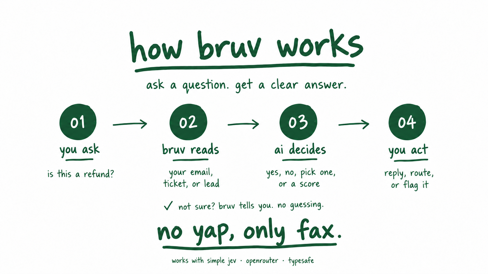
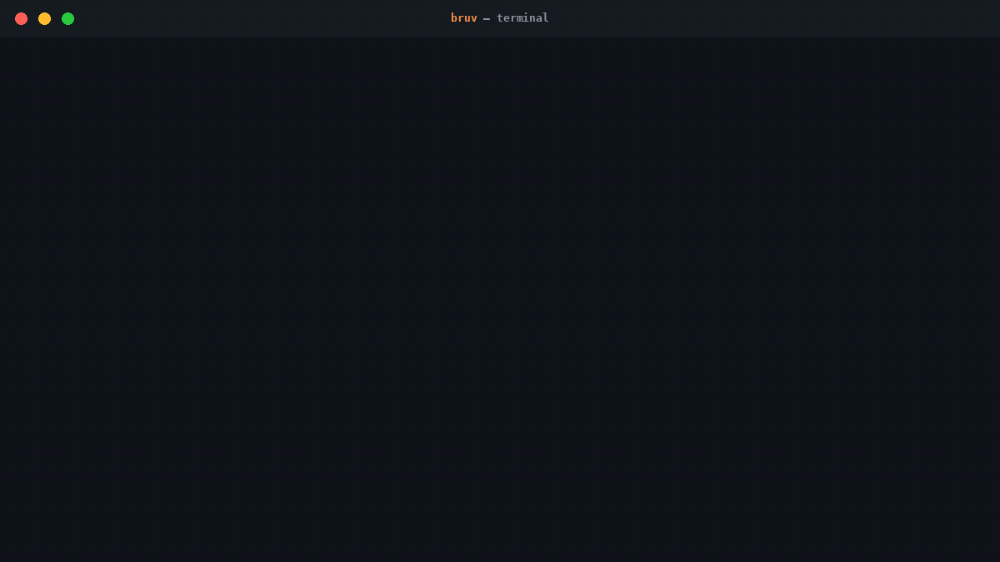

<p align="center">
  
</p>

# bruv





no yap, only fax. bruv gives you typed decisions (yes/no, choice, score) from
TypeSafe Jev or Simple Jev, with one canonical contract, safe onboarding, and
honest calibration disclosure.

> bruv is an independent, unofficial project. It is not affiliated with,
> endorsed by, or sponsored by TypeSafe AI, Featherless AI, or the Qwen Team.

The tagline is brand voice, not an accuracy guarantee.

## How bruv works


Setup flow:

```text
bruv setup simple-jev
        │
        ├── existing install valid? ── yes ──► resume
        │
        └── no
             ├── check disk space
             ├── fetch pinned source
             ├── create isolated environment
             ├── install CPU/CUDA dependencies
             ├── download/cache model
             ├── start server
             ├── smoke test
             └── ready

bruv doctor
        └── config → credentials → endpoint → reachability → capabilities
```

## 60-second install and first result

```bash
python -m venv .venv && . .venv/bin/activate
python -m pip install 'bruv @ git+https://github.com/hichem300/bruv.git'

# Simple Jev public demo endpoint: no key, no local runtime
export SIMPLE_JEV_BASE_URL="https://simple-jev-demo-api.featherless.ai"
export SIMPLE_JEV_MODEL="featherless-ai/gemma-4-26B-A4B-classifier"
bruv noul "Does this ask for a refund?" --state "I want my money back" --backend simple-jev

# JSON for scripts
bruv choice "Which team?" --option sales --option billing --state "help" --backend simple-jev --output json
```

## Human use

- `bruv setup` (interactive) configures a backend and stores credentials safely.
- `bruv doctor` runs non-paid diagnostics and prints one fix per failed item.
- `bruv validate -f request.yaml` checks a request with no paid call.

## Agent use (Codex, Claude Code, Pi)

Install the packaged skill:

```bash
bruv skill install --target pi --scope user
bruv skill install --target claude --scope project --project-root /path/to/repo
```

See `docs/agent-usage.md`.

## Managed Simple Jev

Simple Jev runs locally. `bruv setup simple-jev` installs an isolated runtime
(server, venv, model cache, and logs) under your platform user-data directory
at `bruv/simple-jev`, auto-detects CUDA and falls back to CPU, and downloads
the `Qwen/Qwen3.5-0.8B` model on first install.

On CPU-only hosts the install picks the official CPU torch wheel directly,
so no large CUDA package is downloaded unnecessarily. Pip runs with
`--no-cache-dir`, so no persistent pip cache is left on disk.

After setup, normal simple-jev calls auto-start and reuse the managed server.
Rerunning `bruv setup simple-jev` is safe: it verifies the existing install and
resumes where it left off, skipping steps that are already complete. Use
`--repair` to force a full rebuild instead.

Setup runs a disk-space preflight before downloading packages and the model,
and fails early with the required and available space if disk is too low. Git
and pip output, plus model-loading progress, stream to your terminal so you can
see what setup is doing.

```bash
bruv setup simple-jev                 # install + start managed runtime
bruv serve simple-jev status          # installed / running / healthy / pid
bruv serve simple-jev start
bruv serve simple-jev stop
bruv setup simple-jev --repair        # rebuild broken managed state
```

Prefer a custom endpoint? Set `SIMPLE_JEV_BASE_URL` to disable managed
auto-start and call your own server. No local runtime at all? Point it at the
public Featherless demo endpoint, which needs no key but is rate limited and
serves `featherless-ai/gemma-4-26B-A4B-classifier`:

```bash
export SIMPLE_JEV_BASE_URL="https://simple-jev-demo-api.featherless.ai"
export SIMPLE_JEV_MODEL="featherless-ai/gemma-4-26B-A4B-classifier"
```

Simple Jev stays uncalibrated: bruv always reports `calibrated: false`. In
plain language, that means its score is not a verified real-world probability
and must not be presented as one. After task-specific validation, uncalibrated
scores may be used only as relative model signals or for ranking; do not use
them for threshold decisions or treat them as calibrated confidence figures.

During setup, bruv warns that the default `Qwen/Qwen3.5-0.8B` model can be
non-discriminating in Noul mode (it may score very similar options alike). The same
warning is shown once on your first affected use.

## OpenRouter (paid, hosted)

OpenRouter serves TypeSafe Jev as a paid hosted backend using OpenRouter's
calibrated typed Decisions API (`POST https://openrouter.ai/api/alpha/decisions`),
not Chat Completions. That endpoint returns calibrated probabilities, so bruv
reports `calibrated: true`.

```bash
bruv setup openrouter   # stores key in a protected credential file, no paid call
bruv choice "Which team?" --option sales --option billing --state "help" --backend openrouter
```

- The default model is `~typesafe/jev-latest`. Pricing per the current model
  page: $0.042 per 1M input tokens, zero cost for output tokens.
- `bruv setup openrouter` never makes a paid call; it only validates and stores
  the key.
- Credentials: set `OPENROUTER_API_KEY`, or let setup store it in the same
  protected credential file used for TypeSafe keys. The key is never a CLI
  flag and never lands in the config file.
- Model: `~typesafe/jev-latest` by default; override with `OPENROUTER_MODEL`.
  bruv requires a concrete model slug and rejects `openrouter/auto`.

## Funnel audit demo

```bash
bruv demo funnel-audit --backend simple-jev            # dry run, no paid call
bruv demo funnel-audit --backend simple-jev --execute  # real evaluation
```

## Backends and calibration

- TypeSafe Jev: hosted, calibrated probabilities (population-level).
- OpenRouter: paid hosted access to `~typesafe/jev-latest` via OpenRouter's
  calibrated typed Decisions API; calibrated probabilities, `calibrated: true`.
- Simple Jev: local/self-hosted, explicitly uncalibrated. bruv always reports
  `calibrated: false` for Simple Jev.
- Needle: local Needle 3 inference, no key needed. Optional extra:
  `pip install 'bruv[needle] @ git+https://github.com/hichem300/bruv.git'`. First use downloads about 35 MB of model
  weights, then everything runs on your machine with telemetry disabled
  (`NEEDLE_TELEMETRY=0`). Needle reports confidence only; it never produces
  synthetic probabilities, and score answers carry the selected level index
  plus its legend. Supported platforms: Linux, macOS, and Windows on x86_64
  and arm64.
- RLCD ModernBERT: local calibrated inference via ONNX Runtime on CPU, no
  credential, optional extra: `pip install 'bruv[rlcd-modernbert] @ git+https://github.com/hichem300/bruv.git'`. First use
  downloads a ~606 MB pinned model artifact from Hugging Face, then cached
  runs need no network. Supports noul, choice, and score with calibrated
  probabilities and explicit per-question abstention. Supported platforms:
  Linux, macOS, and Windows on x86_64 and arm64.

## Security and privacy

bruv never accepts API keys as CLI flags. Use the `TYPESAFE_API_KEY`
environment variable or `bruv setup`. No telemetry is sent. See `SECURITY.md`.

## Contributing

See `CONTRIBUTING.md`. Please report security issues privately via `SECURITY.md`.

## Deeper docs

- `docs/installation.md`
- `docs/configuration.md`
- `docs/cli-reference.md`
- `docs/provider-contracts/rlcd-modernbert.md`
- `docs/release-checklist.md`
